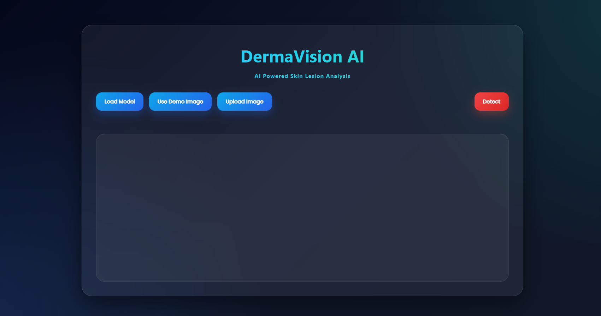

# Skin Cancer Detector Web Application

An advanced web-based framework for classifying various skin cancer types using deep learning and TensorFlow.js. Users can upload dermoscopic images of skin lesions to receive predictive insights into potential skin cancer diagnoses.

---

## Purpose

This application leverages state-of-the-art computer vision techniques to deliver the **top three diagnoses** for a given skin lesion. 

> **Note**: This tool is for **educational purposes** and is not intended as a substitute for professional medical consultation or diagnosis.

---

## Features

- 🕒 **Real-Time Detection**: Instantaneous predictions with TensorFlow.js.
- 📋 **Multi-Type Classification**: Identifies multiple skin cancer types.
- 🖱️ **Drag-and-Drop Interface**: Easy image upload functionality.
- 🖼️ **Demo Images**: Evaluate the model's capabilities with sample images.
- 📊 **Detailed Predictions**: Top 3 classification results with confidence scores.
- 📱 **Responsive Design**: Optimized for mobile and desktop.
- 📈 **Interactive Visualization**: View predictions through dynamic charts.

---

## Technologies Used

- 🧠 **TensorFlow.js**: Real-time inference with deep learning.
- 🌐 **HTML5/CSS3**: For structure and design.
- 📜 **JavaScript**: Implements client-side logic.
- 📉 **Chart.js**: Visualizes prediction probabilities.
- 🏗️ **MobileNet**: Efficient, pre-trained image classification model.

---

## Lesion Types

The model identifies the following skin lesion categories:

1. **nv**: Melanocytic nevi (benign melanocyte neoplasms).
2. **mel**: Melanoma (malignant melanocyte neoplasms).
3. **bkl**: Benign keratosis lesions.
4. **bcc**: Basal cell carcinoma.
5. **akiec**: Actinic keratoses/intraepithelial carcinoma.
6. **vasc**: Vascular lesions.
7. **df**: Dermatofibroma (benign cutaneous lesion).

Descriptions are derived from dermatological research.

---

## Disclaimer

This tool is designed for **educational purposes only**. It is not certified for medical diagnostics. Consult qualified healthcare professionals for medical concerns.

---

## Getting Started

### Prerequisites

- 🌐 A modern web browser (e.g., Chrome, Firefox, Safari, Edge).
- 📶 An active internet connection.

### Running Locally

1. Clone the repository:
   ```bash
   git clone https://github.com/Arianrezaz/SkinCancerTypeDetection.git
   cd SkinCancerTypeDetection
   ```

2. Launch a local server:

   **Using Python:**
   ```bash
   python -m http.server 8000
   ```

   **Using Node.js:**
   ```bash
   npx http-server
   ```

3. Open the application in your browser:
   - **Python**: [http://localhost:8000](http://localhost:8000)
   - **Node.js**: [http://localhost:8080](http://localhost:8080)

---

## Usage

1. **Demo Testing**:
   - Select "Use Demo Image" to test pre-loaded images.
2. **Image Upload**:
   - Drag and drop or click to upload a dermoscopic image.
3. **Generate Predictions**:
   - Click "Detect" for classification results.
4. **Visualize Results**:
   - Review the interactive chart for probability distribution.

---

## Model Information

The application uses a fine-tuned **MobileNet** model trained on dermatological datasets, including:

- **ISIC Dataset**
- **HAM10000 Dataset**

### Datasets Used

Public datasets (ISIC and HAM10000) are used under a **CC BY-NC-SA 4.0 license**. The datasets contain labeled dermoscopic images for training and validation.

---

## Screenshots

### Home Page


### Benign Results


### Malignant Results


---


